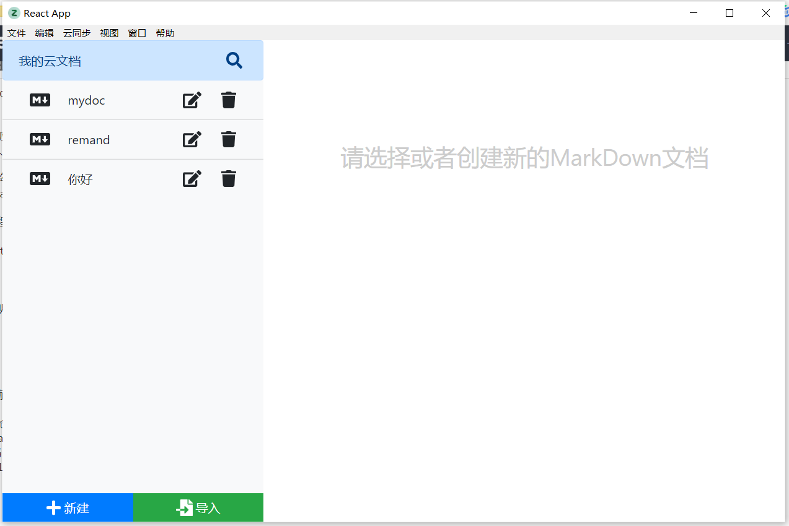
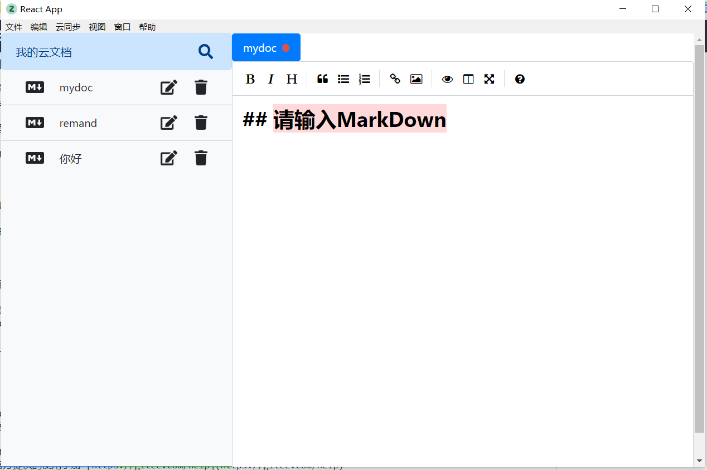
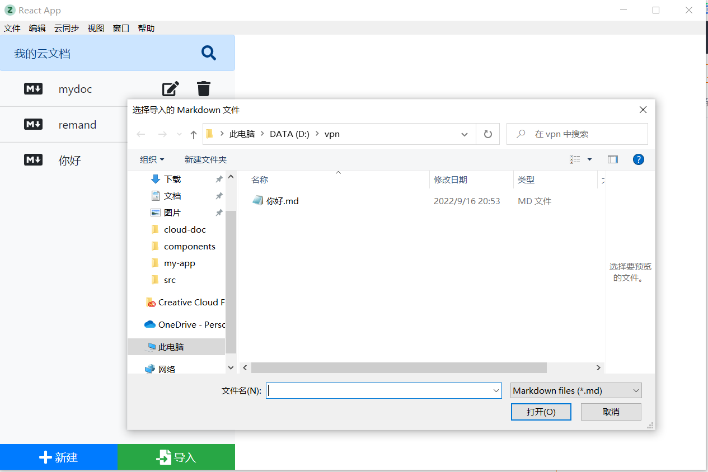
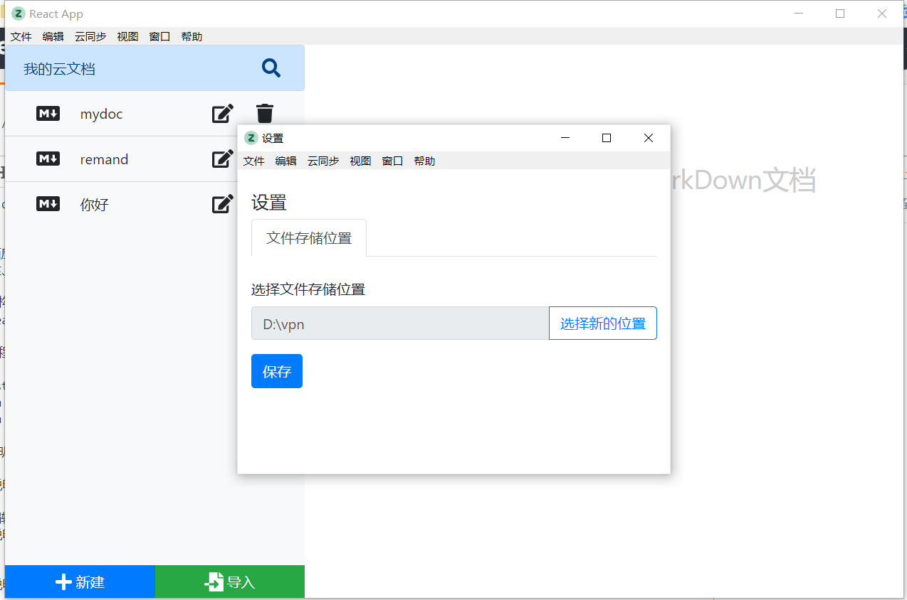

# electron-doc

#### 介绍
我的文档桌面应用
实现文档新建、导入、查找、编辑、删除等功能，实现数据持久化保存，自定义窗口菜单，可更改文档保存路径，实现应用自动更新版本。

#### 软件架构
electron reactHooks node bootstrap

#### 安装教程

1.  npm install
2.  npm run dev（ 启动）
3.  npm run dist (打包）

#### 使用说明

可在编辑器编辑文档，ctrl+s保存:

导入功能：

选择文档存储路径：

可对文档进行修改、删除

windows安装包：https://github.com/xiaoxi1106/electron-doc/blob/master/assets/%E6%88%91%E7%9A%84%E6%96%87%E6%A1%A340-0.1.0.msi
